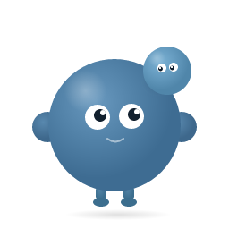

<div align="center">

<br>



<br>

# σῶμα

**The AI coding agent that grows with you.**

<br>

Memory that persists · Muscles that form from experience · Sessions that breathe

<br>

[](https://www.npmjs.com/package/meetsoma)
[](LICENSE)
[](https://github.com/badlogic/pi-mono)

[Website](https://soma.gravicity.ai) · [Docs](https://soma.gravicity.ai/docs/getting-started) · [Hub](https://soma.gravicity.ai/hub) · [Blog](https://soma.gravicity.ai/blog)

</div>

<br>

---

<br>

Most AI agents start from zero every time. You explain the same architecture, the same conventions, the same preferences — every session.

Soma doesn't. She remembers what you worked on, builds reusable patterns from experience, and carries context across sessions. Every conversation is smarter than the last.

<br>

## Install

```bash
npm install -g meetsoma
```

```bash
cd your-project
soma              # Fresh session
soma --continue   # Resume where you left off
soma --resume     # Pick a previous session
```

On first run, Soma creates `.soma/` and discovers her own identity from your codebase.

<br>

## How Soma Works

<br>

<table>
<tr>
<td width="55%">

### 🫁 Sessions Breathe

Every session has a lifecycle: **inhale** (load identity + memory), **work**, **exhale** (save what was learned).

At 85% context, Soma auto-flushes and continues seamlessly. No context is lost. No cold starts.

```
inhale → work → exhale
                  ↓
         inhale → work → exhale
                           ↓
                  inhale → work → ...
```

</td>
<td width="45%">

### 💪 Muscles Form

Patterns Soma sees across sessions crystallize into **muscles** — reusable knowledge that loads automatically.

She builds her own playbook from your work. You don't configure this. It happens.

*Observation → Muscle → Muscle Memory → Protocol*

</td>
</tr>
</table>

<br>

<table>
<tr>
<td width="55%">

### 🔥 Heat-Tracked Protocols

Behavioral rules load by temperature. Heat rises on use, decays when idle.

| Temp | Behavior |
|------|----------|
| 🔥 Hot | Full content in every session |
| 🌡️ Warm | One-line reminder |
| ❄️ Cold | Available but not loaded |

Active patterns stay in prompt. Stale ones fade.

</td>
<td width="45%">

### 🧠 Identity is Discovered

Soma doesn't ship with a personality file. She reads your codebase — your conventions, your stack, your patterns — and writes her own `identity.md`.

Different projects produce different Somas.

</td>
</tr>
</table>

<br>

## Memory Layout

```
.soma/
├── identity.md          ← discovered, not configured
├── STATE.md             ← project architecture snapshot
├── settings.json        ← thresholds, budgets, boot config
├── protocols/           ← behavioral rules (heat-tracked)
├── memory/
│   ├── muscles/         ← patterns from experience
│   ├── preload-next.md  ← continuation state
│   └── sessions/        ← session logs
└── skills/              ← project-specific capabilities
```

<br>

## Commands

| Command | What it does |
|---------|-------------|
| `/breathe` | Save state + auto-continue into fresh session |
| `/exhale` | Save state, write preload, end session |
| `/inhale` | Fresh start — reload identity + protocols |
| `/rest` | Disable keepalive + exhale (end of day) |
| `/keepalive` | Toggle session keepalive |
| `/status` | Current state — identity, heat, context usage |
| `/pin <name>` | Pin a protocol or muscle to hot |
| `/kill <name>` | Drop heat to zero |
| `/soma init` | Create `.soma/` in current directory |

<br>

## Community Hub

Browse and install community-contributed protocols, muscles, skills, and templates.

```bash
soma community install protocol breath-cycle
```

**[→ Browse the Hub](https://soma.gravicity.ai/hub)** · [Contribute](https://github.com/meetsoma/community)

<br>

## Docs

| | |
|---|---|
| [Getting Started](docs/getting-started.md) | Install, first run, session modes |
| [How It Works](docs/how-it-works.md) | Breath cycle, identity, muscles, context |
| [Protocols](docs/protocols.md) | Writing protocols, heat system |
| [Heat System](docs/heat-system.md) | Temperature tiers, auto-detect, decay |
| [Memory Layout](docs/memory-layout.md) | Project vs user, git strategy |
| [Muscles](docs/muscles.md) | Learned patterns, digest system |
| [Extending](docs/extending.md) | Skills, extensions, events, APIs |
| [Configuration](docs/configuration.md) | Settings, thresholds, budgets |
| [Commands](docs/commands.md) | All commands + CLI flags |
| [Changelog](CHANGELOG.md) | Version history |

<br>

## Built on Pi

Soma is built on [Pi](https://github.com/badlogic/pi-mono), the open-source coding agent framework. She inherits Pi's tool system, extension architecture, and model support — then adds identity, memory, and growth on top.

## Contributing

See [CONTRIBUTING.md](CONTRIBUTING.md).

## License

[MIT](LICENSE) — Made by [Gravicity](https://gravicity.ai)

<br>

<div align="center">

*σῶμα (sōma) — Greek for "body." The vessel that grows around you.*

</div>
